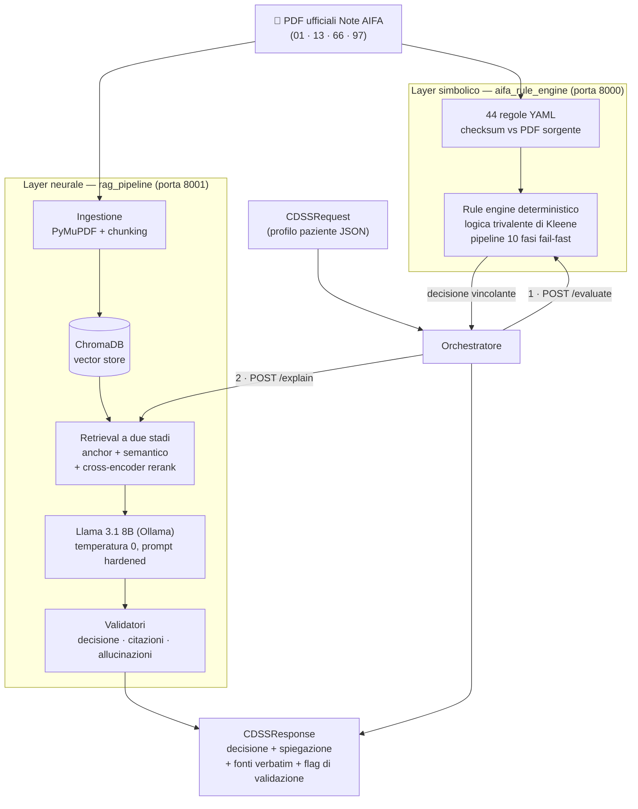

<div align="center">

# 🏥 CDSS Note AIFA

### Un sistema di supporto alla decisione clinica **neuro-simbolico** per la verifica della rimborsabilità dei farmaci soggetti a Nota AIFA

*La decisione la prende un rule engine deterministico e ispezionabile.<br>
La spiegazione la scrive un LLM locale, vincolato a citare il testo normativo.<br>
**Mai il contrario.***

[](https://github.com/GigiMoschetta/cdss-note-aifa/actions/workflows/test.yml)


[Il problema](#-il-problema) ·
[L'idea](#-lidea-separazione-neuro-simbolica) ·
[Architettura](#-architettura) ·
[Risultati](#-risultati) ·
[Quickstart](#-quickstart) ·
[Riproducibilità](#-riproducibilità) ·
[La tesi](#-la-tesi)

</div>

---

## 🎯 Il problema

In Italia, per un sottoinsieme rilevante dei farmaci di fascia A la rimborsabilità da parte del Servizio Sanitario Nazionale **non è automatica**: il medico deve verificare che il paziente soddisfi i criteri clinici definiti nelle **Note AIFA**, atti normativi testuali dell'Agenzia Italiana del Farmaco. La verifica è ripetitiva, soggetta a errore e — quando l'esito è controintuitivo — il medico vuole sapere *perché*, con riferimento puntuale al testo della Nota.

Un LLM da solo non basta: su questo compito **allucina e sbaglia la decisione** (Macro F1 ≈ 0,24–0,32 nelle nostre baseline). Un rule engine da solo decide bene ma **non sa spiegarsi**. Questo progetto dimostra che la combinazione dei due, con responsabilità rigidamente separate, dà il meglio di entrambi.

## 💡 L'idea: separazione neuro-simbolica

| | Layer **simbolico** | Layer **neurale** |
|---|---|---|
| **Responsabilità** | *Decidere* la rimborsabilità | *Spiegare* la decisione |
| **Tecnologia** | Rule engine deterministico — 44 regole YAML, logica trivalente di Kleene | Llama 3.1 8B locale (Ollama) in pipeline RAG a due stadi con reranker |
| **Garanzie** | Verificabile per costruzione, idempotente, audit trail completo | Ogni claim ancorato a un passaggio citato della Nota, validatori anti-allucinazione |
| **Può ribaltare la decisione?** | — | **No, per costruzione** |

L'output del generativo **non può mai modificare l'esito simbolico**: i fallimenti possibili dell'LLM (allucinazione, incoerenza) degradano al più la qualità della spiegazione, mai la correttezza della decisione. È questa proprietà — non una metrica — la tesi centrale del lavoro.

## 🏗 Architettura



La decisione arriva **prima** e **vincola** la generazione: l'LLM riceve l'esito del rule engine come fatto immutabile e il suo compito è solo motivarlo con citazioni verbatim dal testo normativo recuperato.

## 📊 Risultati

Valutazione su **122 casi clinici gold** annotati manualmente (Note 01, 13, 66, 97), riproducibile end-to-end. Numeri dalla run canonica registrata in `Note_AIFA/evaluation/results/`.

### La decisione (il rule engine serve davvero?)

| Sistema | Macro F1 | Δ vs completo |
|---|---:|---:|
| **Sistema completo (neuro-simbolico)** | **1,0000** | — |
| Baseline LLM + RAG (senza rule engine) | 0,3152 | −68 % |
| Baseline LLM + RAG + reranker | 0,2759 | −72 % |
| Baseline solo LLM | 0,2408 | −76 % |
| Baseline classe maggioritaria | 0,2408 | −76 % |

Il divario non è un miglioramento parametrico: è l'**effetto strutturale** dell'affidare la decisione al layer simbolico. Il valore 1,0000 certifica la coerenza interna fra codifica delle regole e annotazione dei casi (i limiti di auto-referenza sono discussi apertamente nella tesi, cap. 6).

### La spiegazione (ci si può fidare del testo generato?)

| Metrica | Valore | n |
|---|---:|---:|
| Hallucination rate | **0,0000** | 122 |
| Citation coverage (per caso) | **1,0000** | 122 |
| Citation F1 | 0,9988 | 122 |
| Logical consistency | 0,9836 | 122 |
| Recall@10 (retrieval) | 0,9068 | 122 |
| MRR (retrieval) | 1,0000 | 122 |
| ALES (composito qualità spiegazione) | 0,6810 | 122 |

### La robustezza

| Proprietà | Pass rate |
|---|---:|
| Idempotenza (stessa richiesta → stessa risposta) | 100 % |
| Robustezza ai casi-frontiera (valori ai bordi delle soglie) | 100 % |
| Determinismo della valutazione (doppia run bit-identica) | ✔ |

## 🚀 Quickstart

**Prerequisiti:** Docker ≥ 24, [Ollama](https://ollama.com) sull'host, GPU NVIDIA consigliata (per l'LLM locale).

```bash
git clone https://github.com/GigiMoschetta/cdss-note-aifa.git
cd cdss-note-aifa/Note_AIFA

ollama pull llama3.1:8b        # modello LLM locale (~4,7 GB)
cp .env.example .env           # configurazione (default già pronti per Ollama)
make setup                     # verifica prerequisiti
make build                     # build immagini Docker
make ingest                    # indicizza i PDF in ChromaDB (~30 s, one-time)
make up                        # avvia rule engine (8000) + pipeline RAG (8001)

curl http://localhost:8000/health   # {"status":"ok", 44 regole}
curl http://localhost:8001/health
```

Poi una richiesta end-to-end (caso gold N01-002: paziente in trattamento cronico con FANS e pregresse emorragie digestive → **rimborsabile**, con spiegazione ancorata al testo della Nota 01):

```bash
curl -s http://localhost:8001/explain -X POST -H 'Content-Type: application/json' -d '{
  "note_id": "01",
  "drug_id": "omeprazolo",
  "patient_data": {
    "trattamento_cronico_fans": true,
    "terapia_antiaggregante_asa": false,
    "pregresse_emorragie_digestive": true,
    "ulcera_peptica_non_guarita": false,
    "terapia_concomitante_anticoagulanti": false,
    "terapia_concomitante_cortisonici": false,
    "eta_avanzata": false
  }
}' | python3 -m json.tool
```

<details>
<summary><b>Setup locale senza Docker</b> (sviluppo)</summary>

```bash
cd Note_AIFA
make install-local    # venv + dipendenze (requirements.lock, hash pinnati)
make ingest-local     # indicizzazione locale
make test-local       # 1025 test
make up-local         # servizi locali
```

</details>

<details>
<summary><b>Demo Streamlit</b> (revisione clinica interattiva, pannello what-if)</summary>

```bash
cd Note_AIFA
make demo-install
make demo             # UI per esplorare casi, decisioni, spiegazioni e fonti
```

</details>

## 🔬 Riproducibilità

Tutti i numeri della tesi si rigenerano **dai PDF normativi ai risultati finali** senza passaggi manuali:

- **Dipendenze bloccate** — `requirements.lock` con hash pinnati; Python 3.12; immagini Docker versionate.
- **Provenienza normativa** — ogni catalogo di regole (`aifa_rule_engine/rules/nota_*/_catalog.yaml`) registra MD5/SHA-256, URL e data di download del PDF da cui le regole sono state estratte; `tools/verify_pdf_integrity.py --strict` valida l'integrità.
- **Cleanroom end-to-end** — `make verify-cleanroom` cancella gli indici, reindicizza da zero, riesegue i 1025 test e ricalcola tutte le metriche.
- **Valutazione ripetibile** — `make eval-rule-engine` (~1 s, senza LLM), `make eval-pipeline`, `make eval-retrieval`, `make eval-full-overnight` con checkpoint di ripresa (`make eval-resume`).
- **Determinismo verificato** — LLM a temperatura 0: due run complete di valutazione producono risultati bit-identici.

## 📁 Struttura della repository

```
cdss-note-aifa/
├── Note_AIFA/                    # il sistema
│   ├── aifa_rule_engine/         #   rule engine deterministico (YAML + Kleene + FastAPI)
│   ├── rag_pipeline/             #   ingestione, retrieval 2-stadi, orchestratore, LLM
│   ├── evaluation/               #   122 casi gold, metriche, baseline, risultati canonici
│   ├── demo/  ·  webapp/         #   interfacce dimostrative (Streamlit, web)
│   ├── docker/ · Makefile        #   deployment e automazione (tutti i target `make help`)
│   ├── tools/                    #   verifica integrità PDF, audit regole vs PDF, cleanroom
│   └── LIMITATIONS.md            #   limiti dichiarati del sistema
├── tesi/                         # l'elaborato
│   ├── Tesi_Zamar_finale.pdf     #   ⭐ versione finale approvata dal relatore
│   └── versione_finale/          #   sorgenti LaTeX completi
└── .github/workflows/test.yml    # CI: ruff + bandit + gold consistency + pytest + eval
```

Dettagli operativi completi in [`Note_AIFA/README.md`](Note_AIFA/README.md).

## ⚠️ Limitazioni dichiarate

Il sistema è una **dimostrazione di fattibilità**, non un CDSS pronto per la clinica: copre 4 Note su oltre 50 vigenti; il dataset gold è sintetico e parzialmente auto-referente; l'LLM è quantizzato (Q4_K_M) per girare su hardware commodity; l'input è un profilo paziente JSON già strutturato, non un estratto da cartella clinica. L'elenco completo e onesto è in [`Note_AIFA/LIMITATIONS.md`](Note_AIFA/LIMITATIONS.md) e nel capitolo 7 della tesi.

## 🎓 La tesi

L'elaborato completo (76 pagine, in italiano) è in [`tesi/Tesi_Zamar_finale.pdf`](tesi/Tesi_Zamar_finale.pdf): contesto normativo, fondamenti (logica di Kleene, RAG, confine neuro-simbolico), architettura, implementazione e una valutazione strutturata attorno a **sette domande di ricerca** con giudizio binario. I sorgenti LaTeX sono in [`tesi/versione_finale/`](tesi/versione_finale/); le versioni intermedie del percorso di revisione restano disponibili nella stessa cartella.

> Prova finale di laurea — Corso di Laurea in Intelligenza Artificiale e Analisi dei Dati,
> Università degli Studi di Trieste, A.A. 2025/2026.
> **Laureando:** Francesco Zamar · **Relatore:** Prof. Andrea De Lorenzo

## 📖 Come citare

```bibtex
@thesis{zamar2026aifa,
  title  = {Un sistema di supporto alla decisione clinica neuro-simbolico
            per le Note AIFA},
  author = {Zamar, Francesco},
  school = {Università degli Studi di Trieste},
  type   = {Tesi di Laurea Triennale},
  year   = {2026}
}
```

## 📄 Licenza

Codice rilasciato sotto licenza [MIT](LICENSE). I PDF delle Note AIFA sono documenti pubblici dell'Agenzia Italiana del Farmaco e restano soggetti alle condizioni della fonte originale.
